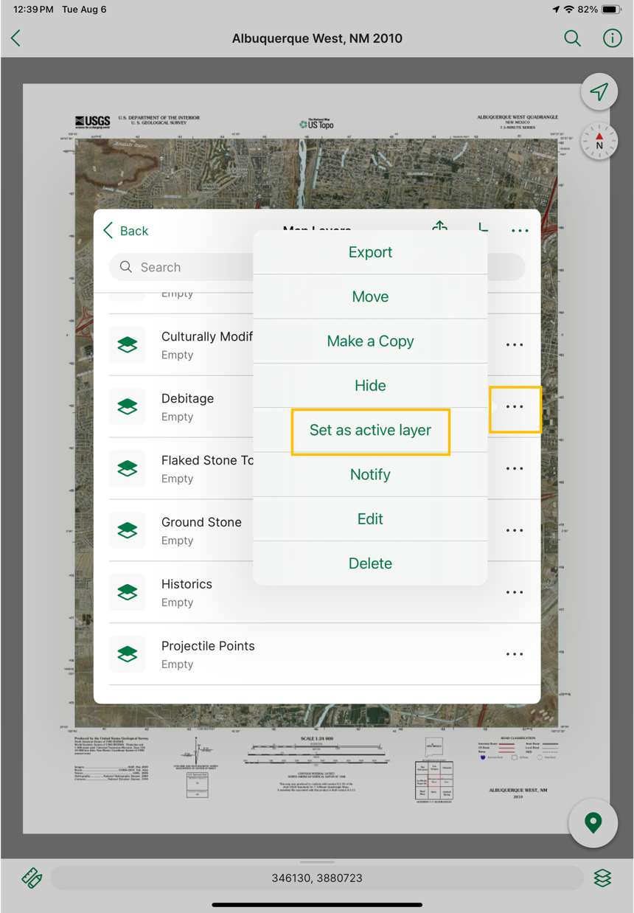
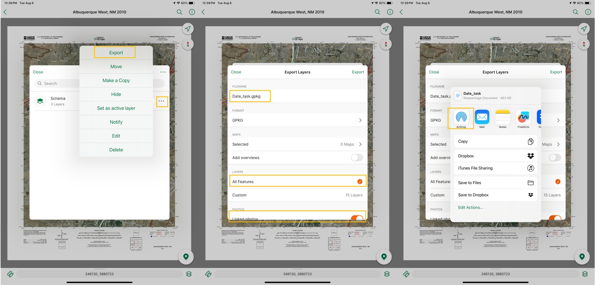

# Digital Recording Workflow Manual Part 2: Field Recording

[Recording and Backup](#recording-and-backup-during-fieldwork)

* [Task A -- Site Form and Data Backup](#task-a-site-form-and-data-backup)

* [Task B -- Feature and Artifact Inventory](#task-b-feature-and-artifact-inventory)

* [Task C -- Photos, Site Boundaries, and Sketch Mapping](#task-c-photos-site-boundaries-and-sketch-mapping)

[Backup](#backup)

[Export and Compiling (After Fieldwork)](#export-and-compiling-after-fieldwork)

# Recording and Backup (During Fieldwork)

Each layer in the schema is associated with a specific task: filling out
the site/isolate form (Task A), conducting an inventory of features and
artifacts (Task B), and taking site photos, recording site boundaries,
and drawing a sketch map (if needed) (Task C). Each task is map-based,
meaning each action will have a specific geospatial point associated
with it.

To begin the task, open the relevant layer (or sublayer). Click the
three dots next to the layer and click "set as active layer." After
changing this setting all points or tracks the user adds will be added
**to this layer**. To record in a different layer, set that new layer as
the active layer.

**Figure 6** *To record a flake, set the debitage layer as the \"active
layer\"*

You should not need to manipulate the other task layers. If you need to
switch tasks with another crew member, it's better to switch devices.

After completing all tasks for a site/isolate (or at the end of the day,
depending on the crew lead's discretion), share that
day/site's updated layer to the crew lead's iPad using AirDrop or a physical drive. Click the three dots
next to your schema and click "Export." Change the name to reflect the
date and task, set the file type to GeoPackage (GPKG), make sure "all
features" is checked, and "linked photos" is toggled on. Then, click
Export (the green option in the upper right) and select the AirDrop
option. Alternatively, export to local storage and move to a physical drive.

**Figure 7** *Follow these steps to AirDrop layers to the crew lead\'s iPad*

## Task A -- Site Form and Data Backup

To complete the site form, this crew member takes a point at the site
datum/site isolate location. To do this, set the appropriate site form
layer (i.e. isolate, site, or site update) as active, click the
navigation button (see Fig. 1, option 3) to snap the crosshairs to your
current location, then click the Add Placemark button (Fig. 1, option
4). Scroll down to the bottom of the placemark box and complete all
relevant attributes. This task will likely require communication with
other team members, particularly those completing Task B. Be sure to
share the designated Site ID with other crew members so that they can
include it in their relevant layers.

## Task B -- Feature and Artifact Inventory

For the artifact and feature inventory, each discrete artifact/feature
will have a geospatial point associated with it. To record a feature,
set the Features sublayer (within the artifacts and features layer) as
active. Then, click the navigation button (see Fig. 1, option 3) to snap
the crosshairs to your current location, and click the Add Placemark
button (Fig. 1, option 4). Scroll down to the bottom of the placemark
box and add the Site ID and a feature description. For artifacts,
navigate to the Artifacts sublayer. Find the artifact category that fits
best and set it as the active layer. Then, click the navigation button
(see Fig. 1, option 3) to snap the crosshairs to your current location,
and click the Add Placemark button (Fig. 1, option 4). Scroll down to
the bottom of the placemark box and complete all relevant attributes.
Many of these attributes include a pick list (e.g., the flake type
attribute in the Debitage layer can be automatically filled in with
complete, proximal, or distal). However, you can always write in your
own answer if none of those fit. Not all attributes will be relevant for
all artifacts recorded (e.g., distal flakes will not have a "platform
type"). At minimum, Site ID (and, ideally, a description) MUST be
completed for all artifacts.

## Task C -- Photos, Site Boundaries, and Sketch Mapping

This crew member creates site boundaries (for new sites/site updates)
and takes site overview and artifact photos. If needed, this crewmember
will also complete a sketch map for the site. For our digital recording
method, each photo is associated with a spatial point. Set the Photos
sublayer to "active." Take a point at the location from which you are
taking the overview (or the location of the artifact you are
photographing). In the artifact's attributes, scroll down to the
"Photos" attribute and click + Add. Select the "Camera" option and take
the photo. Update the Photo Description field (e.g. "Site 1 overview")
and the Direction field (e.g. NNW).

For new/updated sites, set the Site Boundaries sublayer to "active."
Click on the drawing tool (Figure 2, box 5) and select "Record GPS
Tracks." After walking the site boundary, stop tracking and labelling
the track with the site number.

If a sketch map is needed, complete a sketch map in either a digital sketching program or on paper. If using a drawing program, export the drawing as a .jpg. Then, activate the "Sketch Map" layer and take a point at the sketch map's datum. Click +Add next to the photos attribute, and import that image. If a paper sketch map is completed in the field, back it up to the digital recording schema using the Photos layer. First, take a well-lit, readable photograph of the site map. Then, set the Photos sublayer to "active." Take a point at the location of the sketch map's datum. Follow the steps above to add the photograph from the device's internal storage to that point.

## Backup

The crew member completing Task A will also coordinate backing up data in and out of the field. After recording/updating a new site or recording an isolate, all crew members will share their labelled layers this crew member's iPad. The Task A crew member will then back up the received files to a physical storage drive in the field, and to cloud storage or another device after leaving the field. To preserve field names and attributes, these backup files should be GeoPackages (.gpkg).

# Export and Compiling (After Fieldwork)

Upload final project files as GeoPackages to shared cloud storage. After fieldwork, all files will run through a Python script which will extract and sort all images and divide spatial data by site.
