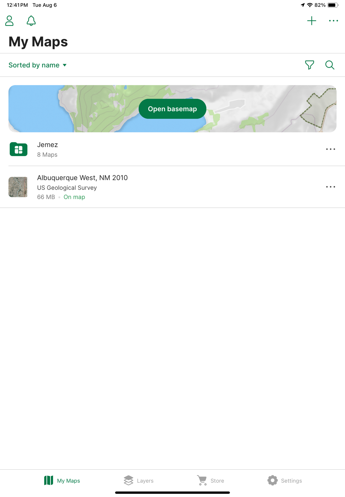
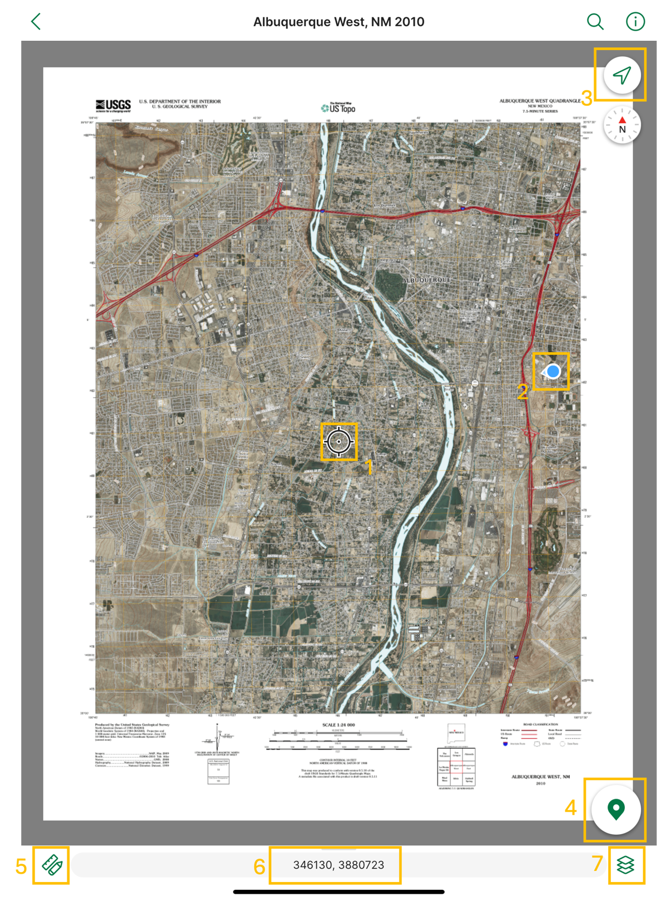
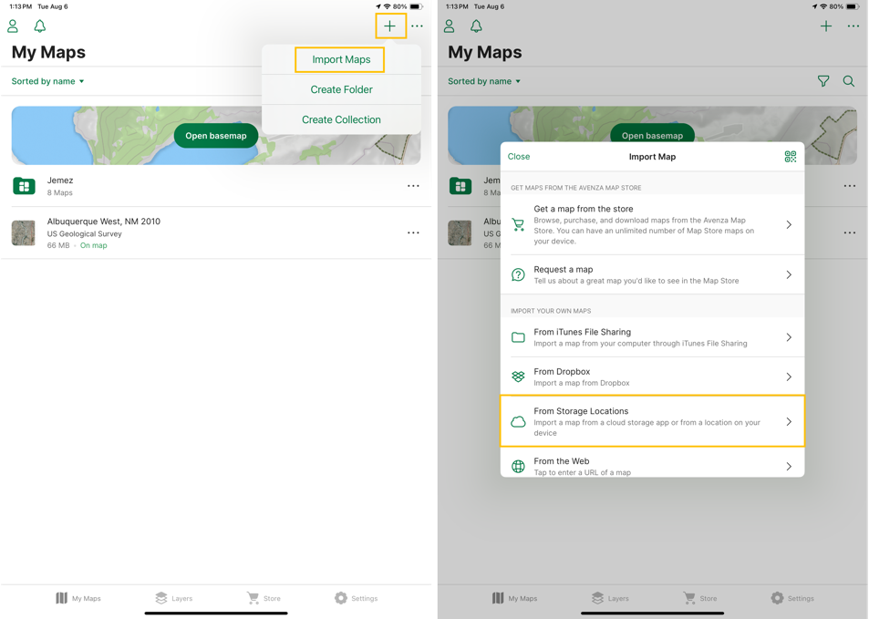
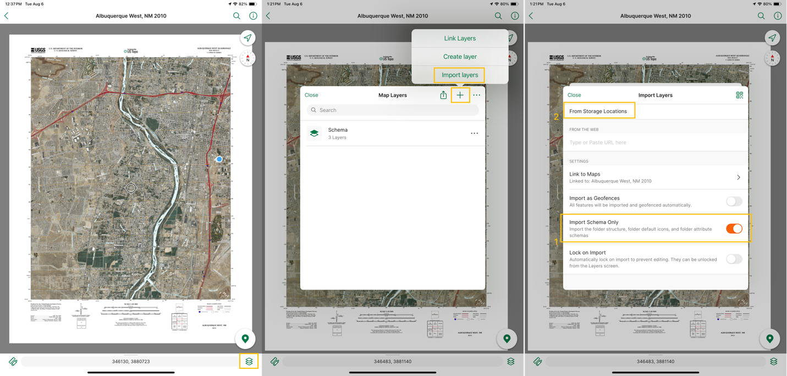
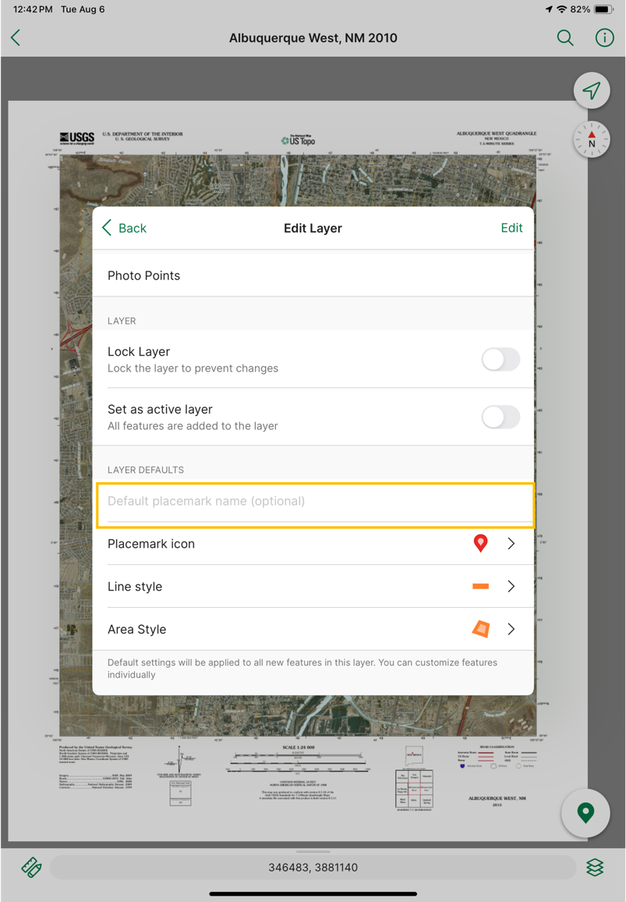

# Digital Recording Workflow Manual Part 1: Pre-field setup

[Summary](#summary)

[Setup (Before Fieldwork)](#setup-before-fieldwork)

[Avenza Basics](#avenza-basics)

[Set Up Tablet with Project Maps and Schema](#set-up-tablet-with-project-maps-and-schema)

[Add project maps](#add-project-maps)

[Add Schema to Map](#add-schema-to-map)

[Set Defaults](#set-defaults)

# Summary

This digital archaeological data recording system divides common site/isolate documentation tasks up into discrete geospatial layers within Avenza Maps, an offline mapping application. Each crew member will be given their own tablet and Bluetooth GPS. Then, they will download survey basemaps, download layer schema and symbologies, and record data for each site/isolate using only the layer which matches their task for the day. In the field, crew members share data to the crew chief after each new site/isolate is recorded (using AirDrop, QuickShare, or a physical drive). The crew chief then backs up the data to a physical drive in the field. At the end of the day, the crew chief backs up the day's data to cloud storage or to a computer's local storage, depending on the project needs. After the project, the final data file can be processed using the Python compiler script (see Post-Field Data Management folder)

# Setup (Before Fieldwork)

## Avenza Basics

Avenza Maps (hereafter "Avenza") is an offline mapping app that uses your device's internal GPS (or connected Bluetooth GPS) to locate you on a georeferenced PDF. These screenshots come from iPads (which our crew used for the case study documented in the manuscript). However, the interface is similar on Android devices. Screenshots were taken while using Avenza at the New Mexico Consortium offices. None of the locations depicted are real archaeological sites.

When you open the main Avenza screen, you are shown a list of available maps:

**Figure 1** *Main Avenza screen*

Your device should already have project maps preloaded (if it does not,
follow the setup steps below). Click on the relevant project map to see
your location overlaid on the GeoPDF.

**Figure 2** *Map example*

There are several functions you can access on the map screen (the
numbers below reference the labels on Fig. 2):

1)  Map crosshairs

2)  Your current location

3)  Navigation button, which snaps the crosshairs (1) to your current
    location (2)

4)  Add Placemark (placemarks are spatial data points -- each task will
    require adding placemarks in designated layers)

5)  Drawing and tracking menu -- open this to draw shapes, record
    tracks, navigate to specific waypoints, or other options

6)  Coordinates at crosshairs (1) -- click the box to copy or change
    format e.g., from UTM to decimal degrees

7)  Access layers

Avenza functions like any other GPS device. You can see your current
location in coordinates and in relation to other points on the map and
add points (4) or tracks (5). You can also measure distance between
points (5) and navigate to points on the map by clicking on a specific
placemark.

All tasks (see detailed descriptions in "Recording and Backup") will
require you to add placemarks and fill out specific attributes for those
points.

**Important:** Clicking Add Placemark (4) will add a point at the
crosshair location (1). If you want the point to be recorded at your
current location, click the Navigation button (3) first.

## Set Up Tablet with Project Maps and Schema

## Add project maps

To set up a field iPad with the correct maps, and schema, open Avenza, click the + icon in
the upper right of the screen (see Fig. 3) and click "Import Maps."
Select "From Storage Location" and select the relevant location. Then select the project maps from the appropriate folder. 

**Note**: For our case study, we kept our project maps in a Dropbox folder accessible from each iPad. Avenza allows map import from any local/cloud account that your device can access.

**Figure 3** *Import a map*

## Add Schemas to Map

After importing the project maps, schema layers need to be imported into the new project maps. To add the schemas to a map (Fig. 4), click the layers button in the lower right hand of the map. In the layers menu, click the + button and "Import Layers." Scroll down and toggle the "Import Schema Only" switch. Then, click "From Storage Locations." Follow the same steps as above to  select the .kml survey schema file from its storage location. Imports should be of KML files only. Other spatial data formats may not import schema correctly.

**Figure 4** *Add schema to a map*

If you need to add any other geospatial data layers (for instance, the
location and boundaries of previously recorded sites) you can follow
this same procedure, but leave "Import Schema Only" unchecked.

## Edit Schema
Editing the schema is easiest to do in Avenza. After adding the schema to the map, navigate to the layer list (Figure 2, option 7). Select the ... next to the desired layer and select "edit." Scroll down to "Attribute Schema" to reorder the attributes, edit the data type for individual attributes (e.g. string vs. integer), or add pick list values (values which show up in a dropdown list when that attribute is selected; users are not limited, however, to picking a value in the pick list). Select "+ Add" next to "New attribute" to add and define a new attribute. In Avenza, attributes are ordered alphabetically by default. While layers can be manually reordered, adding a leading integer to each layer can ensure that they are displayed in the desired order at all times (e.g., 1-Site ID, 2-Site Description). Schema edits can be made in the field. However, those changes will only be reflected on an individual user's device. Schema will need to be reshared to update across all crew members devices.

The process of using these schema to record data is described in detail in the Recording Manual (Field folder).

## Set Defaults

The schema contains relevant layers and attributes for this project (see
"Recording and Backup" section). However, not all defaults will transfer
over from the imported schema. The only **required** default that needs
to be changed after the schema is imported is in the photos layer. Click
the layers button on the bottom right of the map page, then select the
"Photos and Site Boundaries" layer. Click the three dots next to the
layer, select "Edit," and navigate to Layer Defaults. Change the default
placemark name (see Fig. 5) from "Placemark" to "Photo."

**Figure 5** *Change default placemark name for photo layer*

In addition to setting a default placemark name for the photo layer, the
crew member in charge of filling out the site form should make same
change in the site form layer. In that case, change the default
placemark name to "YYYY-ProjectName" so that each field site number will
be preceded by a year and project name. This will help the crew member
assigned to Task A (see below) keep track of field site IDs. Use this
same interface to change additional defaults (e.g., point styles) for
additional layers if desired.
